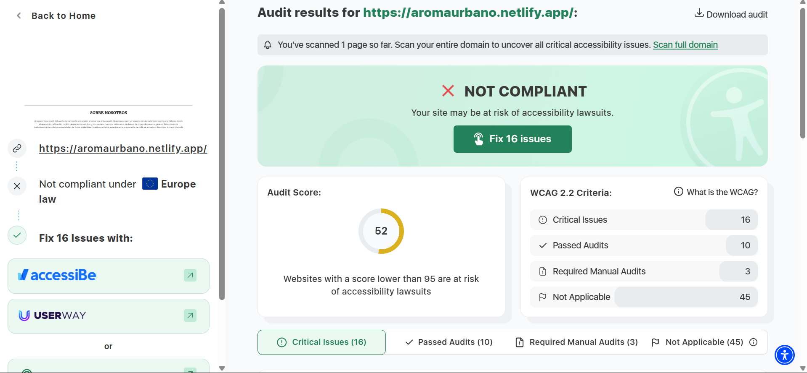

# PROYECTO DE LA ASIGNATURA DISEÑO DE INTERFACES WEB
## AROMA URBANO ☕
Este proyecto es una página web para una **cafetería de especialidad**. La página tiene como objetivo ofrecer una experiencia interactiva para los amantes del café, donde pueden explorar nuestros productos, conocer más sobre los diferentes tipos de café que ofrecemos y aprender sobre la cultura del café de especialidad.

La cafetería se enfoca en ofrecer cafés de alta calidad, con un proceso de preparación meticuloso y una experiencia única para cada cliente.

## TECNOLOGÍAS UTILIZADAS

Este proyecto utiliza las siguientes tecnologías:

- **HTML5** para la estructura de la página.
- **SASS** para la gestión y organización de los estilos CSS.
- **JavaScript** para añadir animaciones a la página.
- **Vite** como herramienta de empaquetado y servidor de desarrollo para mejorar la experiencia de desarrollo y optimizar el rendimiento.

## INSTALACIÓN

1 - Instala las dependencias utilizando npm :
`` npm install ``

2 - Inicia el servidor de desarrollo:
`` npm run dev ``

3 - Si quieres construir el proyecto:
`` npm run build ``

## PRUEBAS DE ACCESIBILIDAD
### 1 - Despliegue
  Para comenzar a realizar las pruebas de accesibilidad lo primero que hice fue desplegar la web en Netlify. Para ello subí la carpeta que contiene todos los archivos de mi web y le cambié el nombre del dominio. 
  
  

### 2 - Herramientas
  Para comprobar la accesibilidad de mi web he usado dos herramientas:

  1 - <a href="https://freeaccessibilitychecker.skynettechnologies.com/">SkyNet Technologies: </a>
      Ofrece un análisis automático que detecta problemas de accesibilidad y proporciona recomendaciones para solucionarlos.
      
  2 - <a href="https://www.accessibilitychecker.org/">Accessibility Checker: </a>
      Revisa el sitio web y genera un informe detallado con advertencias y sugerencias para mejorar la accesibilidad.
### 3 - Resultados obtenidos
1 - SkyNet:


2 - Accessibility Checker:



### 4 - Modificaciones para aumentar la accesibilidad
Según el reporte de Skynet, la web tiene varios problemas que afectan el cumplimiento del nivel AA de accesibilidad. Aquí están los más importantes y cómo corregirlos:


1 - Enlaces que abren en nueva pestaña sin advertencia
    Para enlaces que abren en nueva pestaña añadir una advertencia (se abre en una nueva pestaña):

    ``<li><a href="../index.html#nosotros" target="_blank" title="Se abrirá en una nueva pestaña">Nosotros</a></li>``
    
2 - Problemas con Títulos y Jerarquía
De <h1> paso directamente a <h3>

Antes: 

```html
<section class="nosotros" id="nosotros">
            <h3>SOBRE NOSOTROS</h3>
            <p>Aroma Urbano nació del sueño de compartir una pasión: el amor por el buen café. Queríamos crear un espacio donde cada taza cuente una historia, donde el aroma del café recién molido despierte los sentidos y transporte a nuestros visitantes a las tierras de origen de nuestros granos.
                Seleccionamos cuidadosamente cafés de especialidad de fincas sostenibles. Nuestros baristas, expertos en la preparación de café, se encargan de extraer lo mejor de cada grano, resaltando sus sabores y aromas únicos.
                Te invitamos a ser parte de nuestra historia y a descubrir, en cada sorbo, el cariño, la dedicación y la pasión que nos impulsan. En Aroma Urbano, cada taza es un viaje único.</p>
        </section>
```
        
Después:

```html
<section class="nosotros" id="nosotros">
            <h2>SOBRE NOSOTROS</h2>
            <p>Aroma Urbano nació del sueño de compartir una pasión: el amor por el buen café. Queríamos crear un espacio donde cada taza cuente una historia, donde el aroma del café recién molido despierte los sentidos y transporte a nuestros visitantes a las tierras de origen de nuestros granos.
                Seleccionamos cuidadosamente cafés de especialidad de fincas sostenibles. Nuestros baristas, expertos en la preparación de café, se encargan de extraer lo mejor de cada grano, resaltando sus sabores y aromas únicos.
                Te invitamos a ser parte de nuestra historia y a descubrir, en cada sorbo, el cariño, la dedicación y la pasión que nos impulsan. En Aroma Urbano, cada taza es un viaje único.</p>
        </section>
```

> **Nota:** También tuve que hacer cambios en el SCSS.


